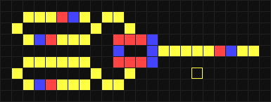

# WireWorld

WireWorld is a cellular automaton simulation implemented in C using the SDL2 library. It simulates the behavior of electrons flowing through a grid of wires, diodes, and other components, making it an interesting and educational tool for exploring digital logic circuits.

## Table of Contents

- [Introduction](#introduction)
- [Prerequisites](#prerequisites)
- [Installation](#installation)
- [Usage](#usage)
- [Controls](#controls)
- [Contributing](#contributing)
- [License](#license)

## Introduction

WireWorld is a project that provides a graphical interface for simulating and interacting with the WireWorld cellular automaton. In WireWorld, each cell on the grid can be in one of four states: empty, wire, electron head, or electron tail. These cells interact according to specific rules, allowing you to build and experiment with digital logic circuits.



## Prerequisites

Before you can run WireWorld, you need to have the following prerequisites installed on your system:

- C compiler (e.g., GCC)
- SDL2 library (Simple DirectMedia Layer 2)
- Make

## Installation

1. Clone this repository to your local machine:

```bash
git clone https://github.com/nikitabushuev/wireworld.git
```


2. Navigate to the project directory:

```bash
cd wireworld
```


3. Compile the project using Make:

```bash
make
```


## Usage

To run WireWorld, execute the following command:

```bash
./wireworld
```

## Controls

- Use the mouse button to place components.
- Use the mouse scroll to switch the brush.
- Press `Space` to start/pause the simulation.
- Drag and drop example files to window

## Contributing

If you'd like to contribute to WireWorld, please follow these steps:

1. Fork the repository on GitHub.
2. Clone your fork to your local machine.
3. Create a new branch for your feature or bug fix.
4. Make your changes and commit them with descriptive commit messages.
5. Push your changes to your fork on GitHub.
6. Create a pull request to the main repository.

## License

This project is licensed under the [MIT License](LICENSE).
